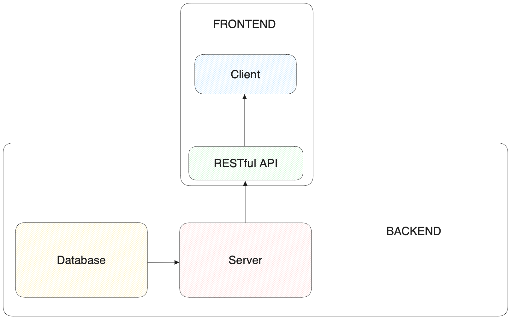
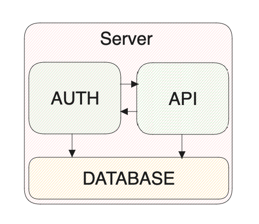
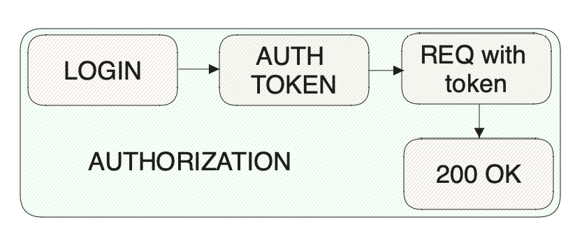
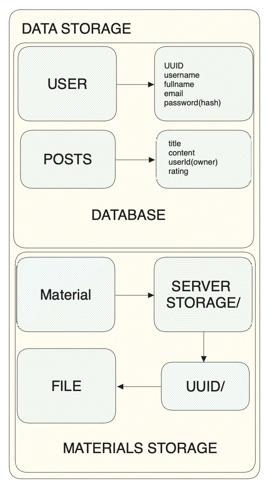

# Design Document
## Context and Scope
StudentHub - is a service where students can share academic materials, presentations,
videos, audios and other files.

StudentHub is developed by team:
* **[Kiril Yakymchuk](https://github.com/stbestichhh)** - team lead and backend developer
* **[Anastasia Slynko](https://github.com/anastasia-sl)** - frontend developer
* **[Max Slisarenko](https://github.com/Cake2Rock)** - frontend developer

## Goals and non-goals
### Goals
* Develop a service, where students from the specific university will share with
academic materials, such as lectures, presentations, videos, audios and othe files.
* Main page with random academic materials.
* Publish posts and academic materials.
* Search for specific materials using keywords, tags or subjects name.
* Rate post or academic material and form it rating, so all the student can see 
how good or bad materials are.
* User profile with the board of all his posts and materials.
* Change user data, such as username, name and surname and etc.

### Non-goals
* Email verification on sign up
* Change user email or password. It requires implementing high security level,
which is unnecessary for the academic project.
* Implementing roles. StudentHub won't have any functionality, that only specific roles
will have access.
* Implementing admin panel. It is unnecessary for small academic project.

## Subsystems
### Components:
* Server - backend component based on Node.js using express.js framework and written on TypeScript. 
Provides RESTful API and sends responses to the client.
* Client - frontend component also based on Node.js using React.js framework. Sends requests
to the server and gets responses from it with data.
* Database - local sqlite database where will be stored all user data. Their posts and materials
will be stored in local storage under their folder on the server.



### Server
Server architecture will be monolith. Developing a server with microservice architecture will be
too complex for the small project. Also it will be problematic to control data which used by both
microservices at the same time. 



#### Authorization system
Authorization system will create users in database and perform user login functionality. For
authorization will be used jsonwebtoken. For accessing any protected routes, client has to send
in request authorization header a bearer token, which will be created on user login.
User passwords will be saved in database as hashed string. For that we will use argon2 library.



#### API

For RESTful API documentation to the StudentHub - see [API Documentation](api.md);

ApiDog docs [here](https://apidog.com/apidoc/project-533931).

#### Data storage
Database will store all user data including their passwords as a hashed string to protect 
their accounts. Also database will store all posts and materials in the specified folder in local
storage directory. All users will get their own uuid on signup and then their folder in storage directory
will be created.



#### Bussiness logic
**Auth system**:
* Create user
* Create auth token
* Verify auth token
* Hash password

**Server (using auth system)**:
* Create, read, update and delete posts
* Upload academic materials
* Download academic materials
* Update user data

**Data storage**:
* Store user data
* Store posts data
* Store uploaded materials

#### HTTP Frontend
Creates data for request and transforms to JSON format, then sends request with data and authorization 
token in auth header. Then this request calls bussiness logic on the server and gets response with 
message or data in json or array format.

**Example**:
* Req:
  * Body:
    ```json
    {
      "username": "IamUser",
      "fullname": "Iam User",
      "email": "user@user.com",
      "password": "strongespassword12345"
    }
    ```
* Response:
  ```json
  {
    "message": "User created."
  }
  ```
